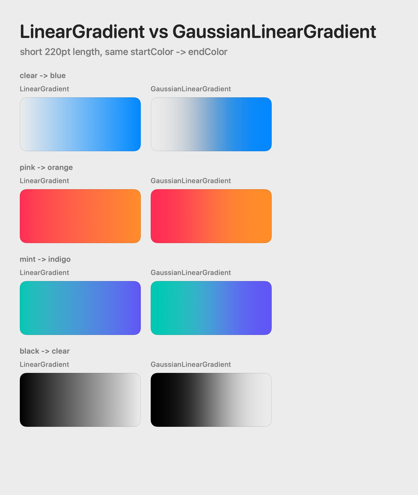

# GaussianLinearGradient

`GaussianLinearGradient` is a SwiftUI `LinearGradient`-compatible view and
`ShapeStyle` that renders linear color ramps with Gaussian-like transitions.

It accepts the same gradient shapes you would normally give to `LinearGradient`,
including three or more colors and explicit `Gradient.Stop` locations, then
samples each neighboring color transition with a cumulative Gaussian curve.



## Requirements

- iOS 17+
- macOS 14+
- Swift 6+

## Installation

Add this package to your Swift Package Manager dependencies:

```swift
.package(url: "https://github.com/FluidGroup/swiftui-gaussian-linear-gradient.git", branch: "main")
```

Then add `GaussianLinearGradient` to your target dependencies.

## Usage

Import the package and use `GaussianLinearGradient` where you would normally use
`LinearGradient`.

```swift
import GaussianLinearGradient
import SwiftUI

GaussianLinearGradient(
  colors: [.clear, .blue, .indigo],
  startPoint: .bottom,
  endPoint: .top
)
.frame(height: 72)
```

`GaussianLinearGradient` also conforms to `ShapeStyle`, so it can be passed
directly to APIs such as `fill`, `background`, and `foregroundStyle`.

```swift
RoundedRectangle(cornerRadius: 12)
  .fill(
    GaussianLinearGradient(
      colors: [.clear, .blue, .indigo],
      startPoint: .leading,
      endPoint: .trailing
    )
  )
```

## LinearGradient-Compatible Initializers

Use `colors` for evenly spaced color ramps:

```swift
GaussianLinearGradient(
  colors: [.red, .yellow, .blue],
  startPoint: .leading,
  endPoint: .trailing
)
```

Use `stops` when the colors need explicit locations:

```swift
GaussianLinearGradient(
  stops: [
    Gradient.Stop(color: .red, location: 0),
    Gradient.Stop(color: .yellow, location: 0.35),
    Gradient.Stop(color: .blue, location: 1),
  ],
  startPoint: .leading,
  endPoint: .trailing
)
```

Use `gradient` when you already have a SwiftUI `Gradient` value:

```swift
let gradient = Gradient(colors: [.mint, .cyan, .indigo])

GaussianLinearGradient(
  gradient: gradient,
  startPoint: .topLeading,
  endPoint: .bottomTrailing
)
```

The older two-color and opacity-ramp conveniences are still available:

```swift
GaussianLinearGradient(
  startColor: .clear,
  endColor: .blue,
  startPoint: .top,
  endPoint: .bottom
)

GaussianLinearGradient(
  color: .black,
  transparentAtStart: true
)
```

## Tuning

`sampleCount` controls how many stops are generated for each neighboring color
transition. Higher values produce a smoother ramp, while lower values create
fewer SwiftUI gradient stops.

```swift
GaussianLinearGradient(
  colors: [.red, .yellow, .blue],
  startPoint: .leading,
  endPoint: .trailing,
  sampleCount: 32
)
```

`standardDeviation` controls how wide each Gaussian-like transition feels in
normalized gradient coordinates. Smaller values make the transition tighter
around the center of each color segment. Larger values spread it more evenly
across the segment.

```swift
GaussianLinearGradient(
  colors: [.black, .clear],
  startPoint: .leading,
  endPoint: .trailing,
  standardDeviation: 0.18
)
```

## Stops

Use `GaussianLinearGradient.stops(...)` when you want to build your own
`LinearGradient` with generated stops.

```swift
LinearGradient(
  stops: GaussianLinearGradient.stops(
    color: .black,
    transparentAtStart: true
  ),
  startPoint: .top,
  endPoint: .bottom
)
```

For resolved colors, you can generate a multi-color stop ramp directly:

```swift
let environment = EnvironmentValues()
let resolvedColors = [Color.red, .yellow, .blue].map {
  $0.resolve(in: environment)
}

LinearGradient(
  stops: GaussianLinearGradient.stops(colors: resolvedColors),
  startPoint: .leading,
  endPoint: .trailing
)
```
